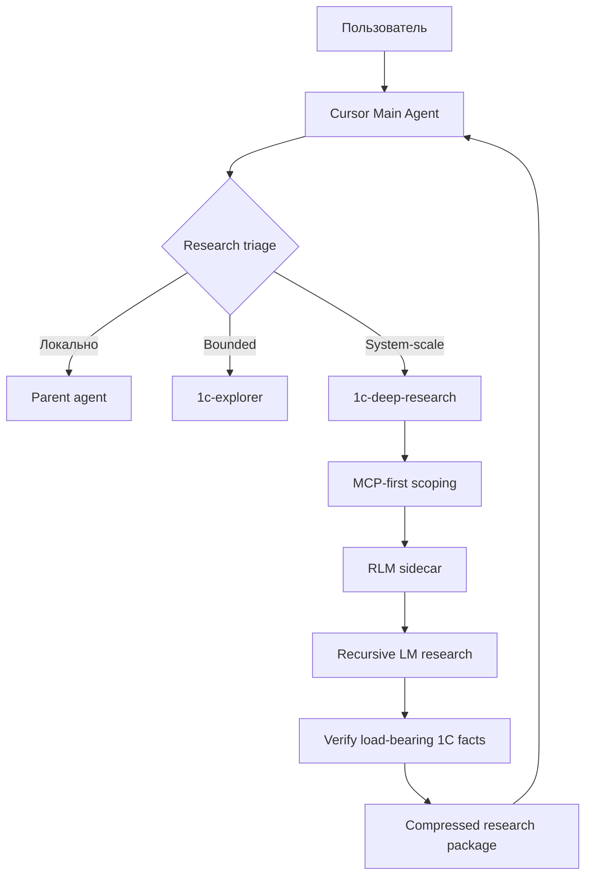

# RLM Deep Research для Cursor и 1С

`1c-deep-research` — отдельный read-only субагент для больших исследовательских задач. Он не заменяет `1c-explorer`: обычный Explorer остаётся для ограниченного поиска, а Deep Research включается, когда нужно синтезировать данные по крупной подсистеме, десяткам объектов или множеству расширений.

## Маршрутизация



RLM запускается только после MCP-first определения области. В него передаётся не весь репозиторий автоматически, а ограниченный исследовательский корпус: вопрос, карта области, релевантные результаты MCP и необходимые фрагменты BSL/XML.
## Установка runtime

RLM — опциональная инфраструктура, не часть 1С-конфигурации. Нужен Python 3.11+ и официальный пакет:

```text
pip install rlms
```

Рекомендуемый `RLM_ENVIRONMENT=docker`: официальный local REPL выполняет сгенерированный моделью Python в процессе хоста, тогда как Docker изолирует REPL от файловой системы проекта, если вы явно не монтируете её внутрь.

В `.dev.env` настройте:

```text
RLM_ENABLED=manual
RLM_BACKEND=openai
RLM_MODEL=<model-id>
RLM_ENVIRONMENT=docker
RLM_BASE_URL=
```

API-ключи (`OPENAI_API_KEY`, `ANTHROPIC_API_KEY` и т.п.) держите в системном окружении/секрет-хранилище, а не в правилах и не в исследовательском корпусе.

## Использование в Cursor

Автоматически: Main Agent выбирает `1c-deep-research`, когда задача системного масштаба и RLM разрешён политикой проекта. Вручную: `/deepresearch system <вопрос>`. Для единичного поиска продолжайте использовать обычный запрос или `1c-explorer`.